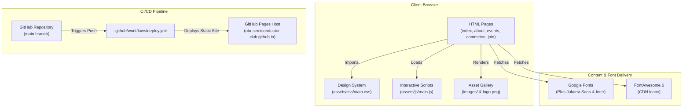

# Architecture & Developer Guide 🛠️

Welcome to the **NTU Semiconductor Club Website** developer and architecture guide. This document provides a complete visual map, design system token reference, and guide for human developers and AI coding assistants ("vibecoders") to rapidly modify, extend, and maintain the website.

---

## 📐 High-Level Architecture Diagram



---

## 📁 Workspace Map

```text
.
├── index.html              # Landing page (Hero, Impact Stats, Focus Areas, Featured Visits)
├── about.html              # About page (Purpose, Full-Stack Vision, Learning Pillars)
├── events.html             # Events & Activities (Upcoming Workshop, Site Visits, GPU/AI Sessions)
├── committee.html          # Leadership Team (Executive Committee & Portfolio Leads)
├── join.html               # Combined Join & Contact Us page (Telegram, LinkedIn, Email, GitHub)
├── .nojekyll               # Bypasses Jekyll build processing on GitHub Pages
├── robots.txt              # Search engine crawler directives
├── sitemap.xml             # XML Sitemap for SEO indexing
├── README.md               # Project overview and quickstart guide
├── ARCHITECTURE.md         # Architecture diagrams, design tokens, and developer guidelines
├── CONTRIBUTING.md         # Vibe coding conventions & AI assistant rules
├── PROFILE_README.md       # GitHub Organization Profile README template
├── assets/
│   ├── css/
│   │   └── main.css        # Unified Design System CSS
│   └── js/
│       └── main.js         # Interactive scripts (Sticky nav, active links, mobile drawer)
└── images/                 # Optimized website image assets
    ├── logo.png            # Official NTU Semiconductor Club Lion Logo
    └── committee/          # Committee member headshots
```

---

## 📬 Official Contact & Community Channels Reference

| Channel | URL | Purpose |
| :--- | :--- | :--- |
| **Telegram Group** | [`https://t.me/+Wsb5No5hvnxlMjRl`](https://t.me/+Wsb5No5hvnxlMjRl) | Real-time member announcements & community chat |
| **LinkedIn Page** | [`https://www.linkedin.com/company/ntu-semiconductor-club/`](https://www.linkedin.com/company/ntu-semiconductor-club/) | Professional updates, company news, and networking |
| **Official Email** | [`mailto:ntu.semiconductor.club@ntu.edu.sg`](mailto:ntu.semiconductor.club@ntu.edu.sg) | Executive committee contact & corporate partnerships |
| **GitHub Org** | [`https://github.com/NTU-Semiconductor-Club`](https://github.com/NTU-Semiconductor-Club) | Open source code, repositories, and documentation |

---

## 🎨 Design System Tokens Reference

All visual styles are centralized in [`assets/css/main.css`](file:///home/ray/dev/clubweb/assets/css/main.css) using native CSS custom properties (`:root`).

```css
:root {
  --bg-primary: #070e1c;
  --bg-secondary: #0c182e;
  --bg-card: #0f1f3d;
  --bg-card-hover: #14274c;
  --brand-blue: #0b57d0;
  --brand-red: #d93025;
  --text-main: #f1f5f9;
  --text-secondary: #94a3b8;
  --border-light: rgba(255, 255, 255, 0.08);
}
```
