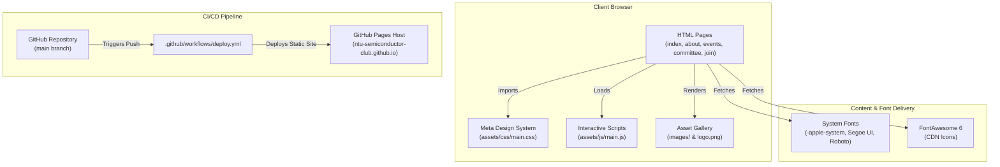

# Architecture & Brand Design Guide 🛠️

Welcome to the **NTU Semiconductor Club Website** developer architecture and brand design guide. This document serves as the authoritative single-source-of-truth specification for human developers and AI coding assistants.

---

## 📐 Brand Identity & Header Specification

All pages **must** strictly use the exact single-source-of-truth header branding markup:

```html
<a href="index.html" class="nav-brand">
  
  <div class="nav-brand-text">
    <span class="nav-brand-title">NTU Semiconductor Club</span>
    <span class="nav-brand-sub">Nanyang Technological University</span>
  </div>
</a>
```

### Brand Tokens Standard

* **Club Name (`.nav-brand-title`)**: `NTU Semiconductor Club` *(Title case, exact string)*
* **Sub-Brand Badge (`.nav-brand-sub`)**: `Nanyang Technological University` *(Uppercase blue subtitle, exact string)*
* **Logo Asset (`.nav-brand-img`)**: [`images/logo.png`](file:///home/ray/dev/clubweb/images/logo.png) *(Height: 44px, drop shadow elevation)*

---

## 📐 High-Level Architecture Diagram



---

## 🎨 Meta Design System Tokens

All visual styles are centralized in [`assets/css/main.css`](file:///home/ray/dev/clubweb/assets/css/main.css) using Meta's design system tokens:

```css
:root {
  --meta-blue: #0866ff;
  --meta-blue-hover: #0052cc;
  --meta-bg: #f0f2f5;
  --meta-surface: #ffffff;
  --meta-surface-subtle: #f7f8fa;
  --meta-text-primary: #050505;
  --meta-text-secondary: #65676b;
  --meta-text-muted: #8a8d91;
  --meta-border: #e4e6eb;
  --meta-divider: #ced0d4;
  --meta-shadow: 0 1px 2px rgba(0, 0, 0, 0.08), 0 2px 4px rgba(0, 0, 0, 0.04);
  --meta-radius-sm: 6px;
  --meta-radius-md: 8px;
  --meta-radius-lg: 12px;
}
```

---

## 📬 Official Contact & Community Channels Reference

| Channel | URL / Contact | Purpose |
| :--- | :--- | :--- |
| **Telegram Group** | [`https://t.me/+Wsb5No5hvnxlMjRl`](https://t.me/+Wsb5No5hvnxlMjRl) | Real-time member announcements & community chat |
| **LinkedIn Page** | [`https://www.linkedin.com/company/ntu-semiconductor-club/`](https://www.linkedin.com/company/ntu-semiconductor-club/) | Professional updates, company news, and networking |
| **Official Email** | [`mailto:ntu.semiconductor.club@ntu.edu.sg`](mailto:ntu.semiconductor.club@ntu.edu.sg) | Executive committee contact & corporate partnerships |
| **GitHub Org** | [`https://github.com/NTU-Semiconductor-Club`](https://github.com/NTU-Semiconductor-Club) | Open source code, repositories, and documentation |
