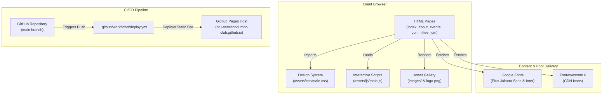
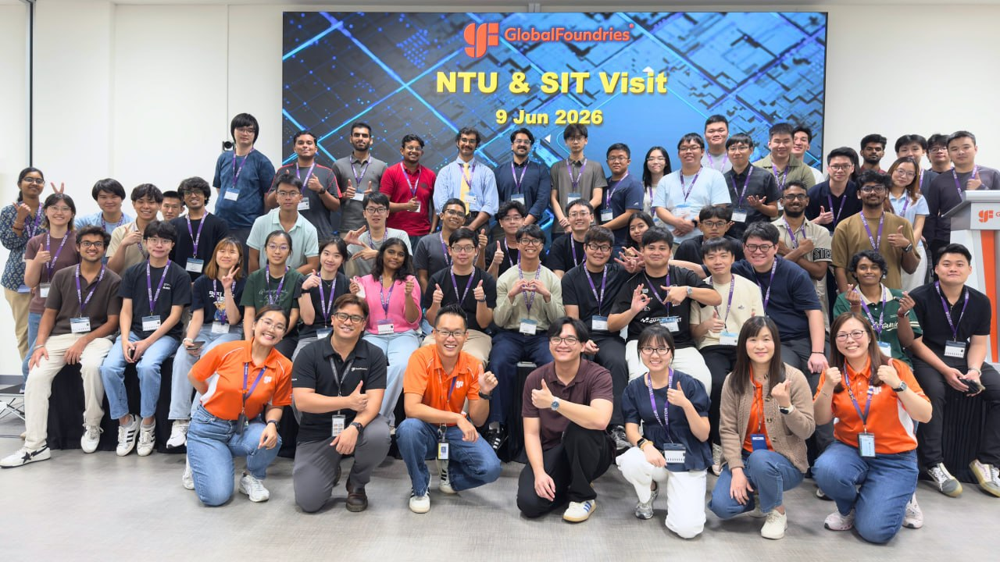
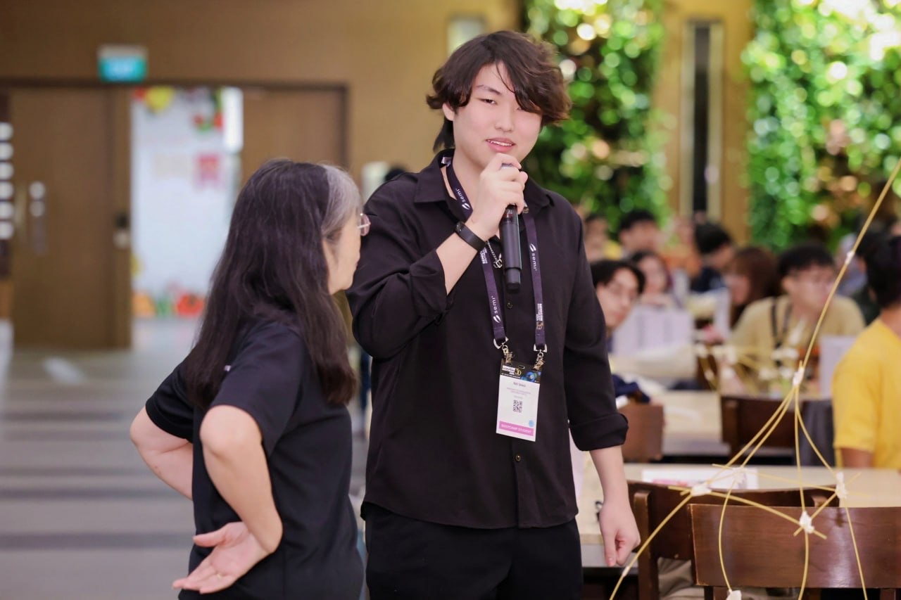

# Architecture & Developer Guide 🛠️

Welcome to the **NTU Semiconductor Club Website** developer and architecture guide. This document provides a complete visual map, design system token reference, and guide for human developers and AI coding assistants ("vibecoders") to rapidly modify, extend, and maintain the website.

---

## 📐 High-Level Architecture Diagram



---

## 📁 Workspace Map

```text
.
├── index.html              # Landing page (Hero, Stats, Focus Areas, Featured Visits)
├── about.html              # About page (Purpose, Vision, Mission, Main Activities)
├── events.html             # Events & Activities (Upcoming Workshop, Site Visits, Career Sessions)
├── committee.html          # Leadership Team (Executive Committee & Portfolio Leads)
├── join.html               # Membership (Benefits, Eligibility, Step-by-Step Join Form)
├── .nojekyll               # Bypasses Jekyll build processing on GitHub Pages
├── robots.txt              # Search engine crawler directives
├── sitemap.xml             # XML Sitemap for SEO indexing
├── README.md               # Project overview and quickstart guide
├── ARCHITECTURE.md         # Architecture diagrams, design tokens, and developer guidelines
├── CONTRIBUTING.md         # Vibe coding conventions & AI assistant rules
├── assets/
│   ├── css/
│   │   └── main.css        # Unified Design System CSS (Variables, Tokens, Components, Media Queries)
│   └── js/
│       └── main.js         # Interactive scripts (Sticky nav, active links, mobile drawer)
└── images/                 # Optimized website image assets (.jpg / .png)
    ├── logo.png            # Official NTU Semiconductor Club Lion Logo
    ├── hero.jpg            # Hero section background banner
    ├── wafer.jpg           # Silicon wafer fabrication image
    ├── workshop1.jpg       # Technical workshop event image
    ├── globalfoundries.jpg # GlobalFoundries foundry tour image
    ├── amd.jpg             # AMD office visit image
    ├── ime.jpg             # A*STAR IME cleanroom research lab visit image
    ├── n2fc.jpg            # N2FC fab tour image
    ├── networking.jpg      # Networking coffee chat image
    ├── career.jpg          # AI & Semiconductor career seminar image
    ├── industry.jpg        # Industry collaboration photo
    └── committee/          # Committee member headshots
        ├── president.jpg   # President headshot
        ├── rishabh.jpg     # VP Internal headshot
        ├── roland.jpg      # VP External headshot
        ├── bryan.jpg       # Events Lead headshot
        ├── pranav.jpg      # Business Development Lead headshot
        └── srishti.jpg     # Publicity Lead headshot
```

---

## 🎨 Design System & Tokens Reference

All visual styles are centralized in [`assets/css/main.css`](file:///home/ray/dev/clubweb/assets/css/main.css) using native CSS custom properties (`:root`).

### Color Tokens

| Token | Hex / Value | Usage |
| :--- | :--- | :--- |
| `--bg-primary` | `#070e1c` | Primary dark page background |
| `--bg-secondary` | `#0c182e` | Alternating section background |
| `--bg-card` | `#0f1f3d` | Default card background |
| `--bg-card-hover` | `#14274c` | Card hover state background |
| `--brand-blue` | `#0b57d0` | Primary action button & accent color |
| `--brand-red` | `#d93025` | NTU Secondary brand accent |
| `--text-main` | `#f1f5f9` | Primary headings & high-contrast text |
| `--text-secondary`| `#94a3b8` | Subtitles, paragraph copy, and captions |
| `--border-light` | `rgba(255,255,255,0.08)` | Card borders & section dividers |

---

## 🧩 Reusable Component Library

### 1. Primary Button (`.btn`)
```html
<a href="join.html" class="btn">
  <i class="fa-solid fa-user-plus"></i> Join Us
</a>
```

### 2. Information Card (`.card`)
```html
<div class="card">
  <h3><i class="fa-solid fa-building" style="color: #60a5fa;"></i> Card Title</h3>
  <p>Card description text goes here.</p>
</div>
```

### 3. Event Card (`.event-card`)
```html
<div class="event-card">
  <div class="event-card-img-wrapper">
    
  </div>
  <div class="event-card-body">
    <h3>Event Name</h3>
    <p>Brief summary of the event activities.</p>
  </div>
</div>
```

### 4. Committee Member Card (`.person`)
```html
<div class="person">
  
  <h3>Member Name</h3>
  <strong>Position Title</strong>
  <p>Short bio or role description.</p>
</div>
```

---

## ⚡ Quick Vibe Coding How-Tos

### How to Add a New Event to `events.html`
1. Save the new event image inside `images/my-new-event.jpg`.
2. Open [`events.html`](file:///home/ray/dev/clubweb/events.html).
3. Copy an existing `.event-card` block and append it to `.industry-grid`:
   ```html
   <div class="event-card">
     <div class="event-card-img-wrapper">
       
     </div>
     <div class="event-card-body">
       <h3>New Event Title</h3>
       <p>Description of what students did during the event.</p>
     </div>
   </div>
   ```

### How to Add a New Committee Member to `committee.html`
1. Save the headshot image inside `images/committee/member-name.jpg`.
2. Open [`committee.html`](file:///home/ray/dev/clubweb/committee.html).
3. Append a `.person` card inside `.team-grid`:
   ```html
   <div class="person">
     
     <h3>Full Name</h3>
     <strong>Role Title</strong>
     <p>Brief description of responsibilities.</p>
   </div>
   ```
