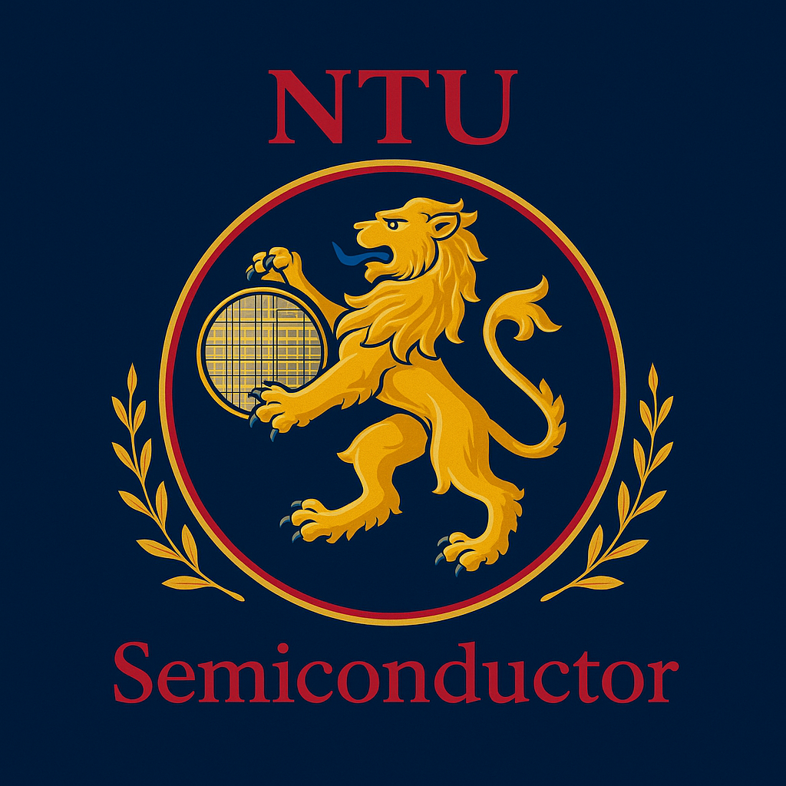

# 👋 Welcome to NTU Semiconductor Club

<div align="center">
  
  <h3>Connecting NTU Students, Industry Leaders, and Microelectronics Innovation</h3>
  
  <p>
    <a href="https://ntu-semiconductor-club.github.io/clubweb"><b>Official Website</b></a> •
    <a href="mailto:ntu.semiconductor.club@ntu.edu.sg"><b>Contact Us</b></a> •
    <a href="https://ntu-semiconductor-club.github.io/clubweb/join.html"><b>Join Membership</b></a>
  </p>
</div>

---

### ⚡ About Us

The **NTU Semiconductor Club** is a student-led organization at **Nanyang Technological University (NTU), Singapore**. We bridge classroom engineering theory with real-world industry practice by organizing foundry site visits, cleanroom tours, technical workshops, and career networking sessions with leading semiconductor firms.

---

### 📊 Club Impact & Community Stats

```text
  ⚡ 400+ Students Engaged Across NTU Engineering & Science Schools
  🏭 10+  Industry Site Visits & Cleanroom Fab Tours Conducted
  🎓 10+  Hands-on Workshops & Career Seminars Hosted
```

---

### 🔬 Core Initiatives & Focus Areas

* 🏭 **Industry Site Visits**: Guided tours of semiconductor foundries, cleanrooms, and testing facilities (GlobalFoundries, AMD, A*STAR IME, N2FC).
* 🛠️ **Technical Workshops**: Student workshops covering IC design principles, device physics, and cleanroom fabrication steps.
* 🤝 **Peer Network**: Connecting students from Electrical Engineering, Computer Engineering, Materials Science, and Physics.
* 💼 **Career Seminars**: Panel discussions, internship opportunities, and mentorship with industry engineers.

---

### 👥 Executive Leadership Team

| Name | Role | Focus Area |
| :--- | :--- | :--- |
| **Ray** | President | Overall Direction & External Alignment |
| **Rishabh** | Vice President (Internal) | Operations, Membership & Student Engagement |
| **Roland** | Vice President (External) | Corporate Partnerships & Industry Relations |
| **Bryan** | Events Lead | Site Visits & Workshop Organization |
| **Pranav** | Business Development Lead | Corporate Outreach & Sponsorships |
| **Srishti** | Publicity Lead | Media, Outreach & Branding |

---

### 📬 Connect & Join

* 🌐 **Official Website**: [NTU Semiconductor Club Portal](https://ntu-semiconductor-club.github.io/clubweb)
* 📧 **Email**: [ntu.semiconductor.club@ntu.edu.sg](mailto:ntu.semiconductor.club@ntu.edu.sg)
* 📍 **Location**: Nanyang Technological University (NTU), 50 Nanyang Ave, Singapore 639798

---

<div align="center">
  <sub>© 2026 NTU Semiconductor Club. Nanyang Technological University, Singapore.</sub>
</div>
